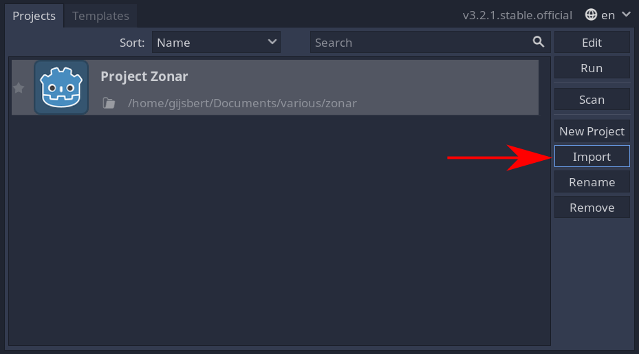
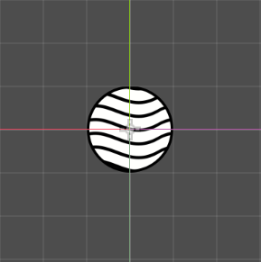
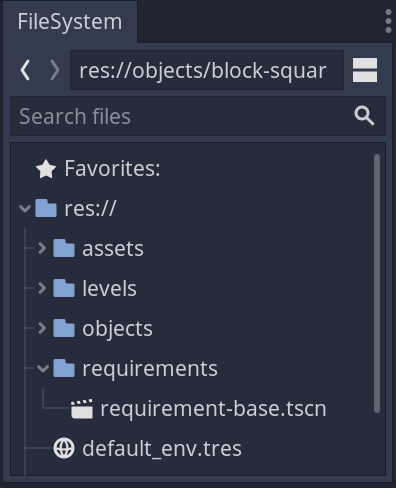

# Godot Physics Engine tutorial

In this tutorial you're going to learn how to make use of the Godot physics engine to build a game while writing very little code. The physics engine is the part of Godot that makes a certain kind of objects behave according to the rules of physics in the game world. This enables us to make things fall down, and touch each other, without writing any code.

## Requirements

For this tutorial you need a computer with the Godot Engine installed. You can use the [Godot Engine on Steam](https://store.steampowered.com/app/404790/Godot_Engine/), or you can download it directly from the [Godot website](https://godotengine.org/).

## Getting started

Next you're going to have to download this project's [start point](https://github.com/Ghostbird/BUKpc20-koding-physics/archive/0-getting-started.zip). Extract the ZIP somewhere on you computer.

Now open Godot and select `Import`. 

Select the path where you extracted the ZIP, click the `project.godot`, then select `Import & Edit`.

## Rigid body physics

Rigid body physics is a name for the behaviour that you would expect a hard, solid object to have in the real world. In the project, a few rigid bodies have already been prepared.

In the left bottom part of the Godot window is the _FileSystem_ tab. Open the folder _objects_ and open _block-square.tscn_.

In the _Scene_ tab on the left you can now see that a square block object is a `RigidBody2D` that has a `Sprite` and a `CollisionShape2D`. The sprite is the picture that makes the rigid body visible. The collision shape has been made invisible. Click the closed eye icon to the right of `CollisionShape2D` to show the blue collision shape overlay.

As you can see the collision shape closely matches the shape of the picture. This makes the behaviour as realistic as possible. Click the now opened eye icon again to hide the collision shape.

In the _Scene_ tab, click `RigidBody2D`. Now to the right at the _Inspector_ tab. You can see that the _Mass_ of the square block is set to 1.

Now in the _Filesystem_ tab open the _block_horizontal.tscn_. You'll see that it has the same structure as the square block, but a different picture and shape. In fact it is the size of two square blocks. Click `RigidBody2D` here, and look at the _Mass_. It has been set to 2. This means that it will behave exactly twice as heavy as the square block.

To us this makes perfect sense, but this is one step that you must not forget when you create your own rigid bodies. Godot cannot know that you want this object to be twice as heavy as the other, simply because it is twice as big. It could very well be that one was made of stone and the other of wood.

### Add a ball

Now you'll create your own rigid body. In the top left corner of Godot, click _Scene_ » _New Scene_. In the new scene on the left side, click `+ Other Node`. Select `RigidBody2D` and click `Create`.

Next click the `+` icon to add a child node or press <kbd>Ctrl</kbd><kbd>A</kbd>. Select `Sprite` and click `Create`.

In the _Inspector_ tab to the left, you'll see that _Texture_ is `[empty]`. In the bottom-left _FileSystem_ tab, open the _assets_ folder and click and drag `ball.png` onto the `[empty]` value after _Texture_. Now you should see a huge ball in the central scene view.

Grab one of the corners of the ball image and drag it while holding <kbd>Shift</kbd>, to resize it to a square that is two by two grid tiles in size. Then reposition the sprite so the centre cross is on the intersection of the coloured axes. 

Now you have the image of the ball in place. However, there's still a yellow alert icon after the `RigidBody2D` in the _Scene_ tab. That is because you have specified how the object looks, but not yet how it is shaped.

Click the `RigidBody2D` in the _Scene_ tab. Add a child node. Select `CollisionShape2D` and click `Create`. Look at the _Inspector_ tab to the right. You'll see that the _Shape_ is `[empty]`. Click it and select _New CircleShape2D_. You'll see a small blue dot in the centre of your ball. Grab the orange point and drag it so the blue area exactly covers the picture of the ball.

Now you don't need to see the collision area any more, so in the _Scene_ tab, click the icon after `CollisionShape2D` to hide the blue overlay.

Finally save this file in the _objects_ folder as _ball.tscn_.

## The first level

Now that you have prepared the necessary objects, you can build a first level just to play around in.

Open _levels/001.tscn_ in the _FileSystem_ tab. This is a level with just one base `Node2D` that has been named `World`.

From the _Filesystem_ tab _objects_ folder, drag a couple of blocks and balls into the 2D view. Remember to place them within the thin blue outline that shows the _camera viewport_. Otherwise they will be off-screen.

Now click _Play Scene_ in the top right part of the window, or press <kbd>F6</kbd> to start the current level.

If everything went alright, you'll see the placed objects drop out of view. This shows that gravity works.

Of course, this is rather boring.

### Static body physics

Since you want something to build on, you need to learn a second type of physics engine body. The static body has the same collision behaviour as the rigid body, but it cannot move. This is the ideal type of object to use for the fixed parts of your world.

Click the `World` in the _Scene_ tab and add a `StaticBody2D`.  Rename this `StaticBody2D` to `Ground` just to easily identify it.
Drag the `Ground` down to the bottom of the camera viewport. It doesn't matter that it won't exactly snap to that line.

Add a `CollisionShape2D` to the `Ground`. Then in the _Inspector_ tab, click the _Shape_ `[empty]` and select _New RectangleShape2D_. Grab a corner the blue square that has appeared in the view and drag to widen it so that the rectangle covers at least the bottom of the camera viewport.

Now press _Play Scene_ again and see what happens. If everything went well, the falling objects should have stopped just above the bottom of the screen.

However, it is a bit weird that the ground is essentially invisible. To remedy that, click the `Ground` in the _Scene_ tab and add a `ColorRect`. It should appear as a white square below the ground line in the 2D view. Move and resize it so it covers the blue rectangle that indicates the collision shape. For some added flair, click the _Color_ property in the _Inspector_ tab and pick a colour of your choice.

When you now _Play Scene_ again, you should see your rigid bodies fall down onto the coloured ground.

### Building time

Drag objects into the 2D view and build something by stacking them. You should enable _smart snapping_ to allow the blocks to snap correctly to the half-way points in the grid. Pay attention that when have placed a block, you click the background to deselect it before you drag the next object in. Otherwise you might attach objects to each other, and that can give unexpected behaviour.

## Practical physics

If you place a ball in the air, and you can have it destroy you building as it falls down. You might notice that the ball is not doing much damage. This is because the ball is fairly light compared to the blocks. However, we can change the mass of this specific ball in the level. Click the ball, then in the _Inspector_ tab change the _Mass_ to `10`. Now when the ball falls down on your building, you can see that it shakes it quite a bit more.

Mass is not the only physical property that we can edit in the Godot physics engine. Many more properties that you might recognise from physics at school are editable.

Place the ball a distance away to the left of your building, a short distance above the ground. If you lack space, you can drag select the entire building and move it entirely to the right to free up some space.

Now click the ball and in the _Inspector_ tab scroll down a little, you'll see the header _Angular_ which has a _velocity_ value. Change it to 1000 and hit _Play Scene_ to see what happens.

If all went well, you've just created a heavy ball that is spinning at high speed, and will start slipping and rolling towards your building once it contacts the floor. You'll notice that it is slowed by to contact with the floor and the building blocks.

It becomes even funnier when you look at the _Linear velocity_ and set its `x` to `1000`. This should turn your ball into a projectile that rams your building at high speed and rotation.

Of course the ball is not the only thing with these properties. Every building block can have its values changed too. What happens when you change the _Gravity Scale_ on a foundation block of your building to `-10`?

Other interesting properties are the linear and angular _Damp_ which stands for damping. This means how much of its velocity is lost, gradually, or through collisions. The standard value of `-1` is a special value and uses the standard physics engine value. If you give the ball an angular velocity and set its damping to `0`, it will hardly ever stop turning, even when it rolls into something.

### Interaction

This of course is all fun, but before it becomes a real game you need some form of interaction. Therefore, we must write some code. Luckily, the code to make this into a fun _sandbox_ is very simple.

Open the `objects/ball.tscn`. Click the `RigidBody2D`, click `Attach script` button and click `Create`. Then select everything and replace it with this piece of code:

```gdscript
extends RigidBody2D

export var elastic_strength = 10;

func _physics_process(delta):
    # If the user holds down the left mouse button
    if (Input.is_mouse_button_pressed(BUTTON_LEFT)):
        # Apply elastic band towards the current mouse position
        self.applied_force = (get_global_mouse_position() - self.position) * elastic_strength;
    else:
        # Remove elastic band
        self.applied_force = Vector2(0,0)
```

Now go back to the 2D view of the level. _Run Scene_ and hold down the left mouse button. If everything went well, all balls in the level should gravitate towards your mouse cursor, as long as you hold the button down. The further they are from your mouse, the more they are attracted, as if connected by a rubber band.

One interesting thing is that in the code above, we `export` the `var elastic_strength`. This means that you can edit it in the editor, just as we could with the other physics values.

If you did not already have multiple balls in the level, add one. Then change on of the balls' `elastic_strength` to `5`. _Play Scene_ once more, and see how they behave.

## Goals

Now that you have a sandbox game, you might want to add a way to win a level. To do that we're going to program a simple requirement.

Click _Scene_, _New Scene_ and select `2D Scene` as root node. Rename the `Node2D` to `Base`. Then save this scene in a new folder _requirements_ and name it _base.tscn_.



Now, click the button to attach a script, then click `Create`. Replace the contents of the script with:

```gdscript
extends Node2D

export(String) var next_level;

var passed = false;

func _process(delta):
    # Requirements passed and there is a next level
    if (passed and next_level != null):
        # Go to the next level
        get_tree().change_scene("res://levels/" + next_level + ".tscn")
```

Congratulations, you have just created an impossible requirement. You'll never pass this requirement. And therefore you'll never reach the next level. It might seem kind of stupid, but we will use this as the base for more complex requirements.

### A real requirement

Click _Scene_, _New Scene_ and select `2D Scene` as root node. Rename the `Node2D` to `OffScreen`. Then save this scene in a new folder _requirements_ and name it _off-screen.tscn_.

Click the `OffScreen` and attach a new script. Now in the window, don't click `Create` right away. Instead click the folder icon after _Inherits:_ `Node2D`.  Then select _requirements/base.tscn_. The _Inherits:_ should now be `"res://requirements/base.gd"`. Click `Create`. Remove everything below the first line of the script. It should look like this:

```gdscript
extends "res://requirements/base.gd"
```

This script now has all the functionality of the `Base` requirement, even though you don't see it.

Click the `OffScreen` in the _Scene_ tab, and attach a new child node. Select `VisibilityNotifier2D`.

Click the `VisibilityNotifier2D` in the _Scene_ tab and now look to the right side of the window. Besides the _Inspector_ tab, there is the _Node_ tab.

Click the _Node_ tab. Now _double_-click `screen_exited()`. Then click `Connect`. You're now back in the script of the `OffScreen` but a few lines have been added. It should look like this:

```gdscript
extends "res://requirements/base.gd"

func _on_VisibilityNotifier2D_screen_exited():
    pass # Replace with function body.
```

The function `_on_VisibilityNotifier2D_screen_exited` is only activated when this object leaves the screen. That is exactly what you want as a requirement.

Change the code to make the requirement `passed` once the object leaves the screen. Do not be confused by the word `pass` that is already here. That has _nothing_ to do with The final code should look like this:

```gdscript
extends "res://requirements/base.gd"

func _on_VisibilityNotifier2D_screen_exited():
    passed = true
```

This way you've made a real requirement that should be moved off-screen before it passes. Before we can do that though, we need one more thing. That is a second level to go to.

Create a _New Scene_, choose `Node2D` as root node, and save it in _levels_ as _002.tscn_. Leave it empty for now.

Now go back to level _001_. Choose a block in your building and click it. You should see it selected in the _Scene_ tab. Now from the _FileSystem_ tab drag the _off-screen.tscn_ and drop it on the selected block.

Click the added `OffScreen`, then click the _Inspector_ tab. At the top you should see: _Next Level_. Click the field and enter `001`. That is the filename of the level without _.tscn_.

Now run the game and see what happens when you knock this chosen block off-screen. As soon as it flies off screen, you'll see the empty screen of level 2. Now you can build level 2, and add another block there that must be knocked off screen.

There are many possibilities now:

- You are not limited to one requirement.
- Not every requirement has to go to the same level.
- You could add walls to level 2, so it is harder to knock the target block off screen.
- You could create an object that has the level itself as _Next Level_ value. If that block leaves the screen, you've failed and the level resets.
- You could set the _Elastic Strength_value of a ball to a negative value, so you push it instead of pulling it.
- You can even use this to create a sort of main menu for the game! Which block you knock away determines to which level you go.
- You can create new _requirements_ scenes with different logic to set the passed value.

Have fun!
